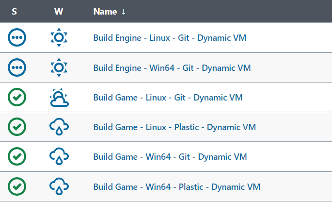
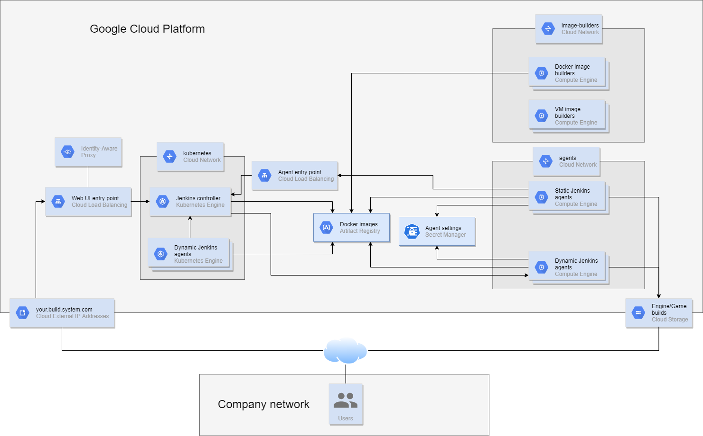

# Build Unreal Engine & games with Jenkins on GKE/GCE

# Overview

This is a [Jenkins](https://www.jenkins.io/)-based build system that runs on [Google Kubernetes Engine (GKE)](https://cloud.google.com/kubernetes-engine) / [Google Compute Engine (GCE)](https://cloud.google.com/compute). It is designed to build Unreal Engine and UE-based games. Windows and Linux targets supported.

Build jobs are typically run on VMs whose disks are persistent (to support quick incremental builds) but are started/stopped as necessary (to reduce cost).

You can access the Jenkins UI directly over the Internet; it is protected using [Identity-Aware Proxy](https://cloud.google.com/iap). 

The build system is complex to operate, and pricey, but it is reliable and convenient for users.

# Status

We are using this in production.

Example jobs:

There are some other jobs, which are mainly for R&D purposes:

# Architecture

# Operation

[Terraform](https://www.terraform.io/) is used to create all infrastructure. This includes load balancers, storage buckets, and a Kubernetes cluster. The cluster has a couple of node pools, some of which scale dynamically based on demand.

[Helm](https://helm.sh/) is used to deploy the Jenkins controller.

The Jenkins controller contains a Seed job. When the Seed job is run, a couple of [Job DSL](https://jenkinsci.github.io/job-dsl-plugin/) files are processed; these in turn create the engine/game specific jobs.

Terraform is used to create static VMs, and templates for dynamic agent VMs.

[A modified version of Jenkins' GCE plugin](https://github.com/falldamagestudio/google-compute-engine-plugin) is capable of creating and destroying agent VMs on-demand. These "dynamic" agent VMs can also be retained (changed to stopped state, instead of being destroyed) between jobs by the modified GCE plugin. This eliminates most of the cost for the dynamic VMs when they are not in use, while keeping the warm-up time for jobs low.

It is also possible to run jobs on Kubernetes. These will suffer from long image pull times when new nodes are provisioned. For incremental builds, the jobs will need to have PVCs provisioned.

Regardless of agent type, each agent has a single executor, and thus serves only one job at a time.

For VMs: The Jenkins agent and all build tools are installed directly onto the VM, and build jobs are run directly on the VM as well.

For Kubernetes: The Jenkins agent runs within a Docker container. Build jobs are also run within a Docker container (via the Kubernetes pipeline plugin). The build tools container images contain all software necessary to build a typical UE engine or game on Linux and Windows.

# Agent types

## Dynamic VMs (Recommended for GCP)

The most cost-efficient way to use this on GCP is via Dynamic VMs. The GCE plugin maintains a small pool of VMs for each individual build job (or for each group of build jobs). These VMs are stopped when not in use; this maintains state on their disks, but at a relatively low cost. These VMs are relatively quick to start up (30-60 seconds depending on OS).

## Static VMs

These agents are ready to accept jobs at a moment's notice. However, be careful with costs! The primary reason for these is to validate that the swarm agent works (that's how you'd run on-premises agents).

## Kubernetes pods 

These _can_ run UE jobs ... but it is rarely a good idea when run on auto-scaled GKE, since [provisioning a new Windows node and pulling the required images can take 20 minutes](https://github.com/falldamagestudio/UE-Jenkins-BuildSystem/issues/20) and GKE does not allow us to modify the autoscaling logic. If you want to do incremental builds, you need to create PVCs within the Kubernetes cluster and change the corresponding jobs to use those PVCs. Incremental builds on GKE with autoscaling are not compatible with Plastic SCM, because Plastic needs to persist some info in the .plastic4 folder together with the workspace, and Jenkins Kubernetes plugin does not allow us enough control to persist that correctly.

Jobs run on Kubernetes should rather be things that run on Linux only, does not need so much state, and does not need large build tools containers.

Jobs run on Kubernetes might make sense for an on-premises OpenShift cluster. Since the nodes won't be dynamically-provisioned there, the Docker containers will quickly be cached on all nodes. However, the Plastic
compatibility problems remain unsolved; you'd need to sort that out yourself.

## Self-hosted agents (recommended for on-premises hardware)

You can start up a Swarm agent on any machine of your choosing, and point it to the internal IP of the Jenkins controller, assuming that you have connected your company network to the agent network in GCP. The agent should connect and handle jobs. There is no automation to help with this in this repo though.

# Security considerations

This build system is designed to be safe to expose to the Internet.

## Controller

The Jenkins controller runs within GKE.

It is exposed to the Internet via a load balancer.
Identity-Aware Proxy is enabled for that load balancer. This ensures that anyone who wants to send HTTP traffic to the Jenkins controller has authenticated with a Google account on your internal domain first. Non-authenticated HTTP calls will not reach the Jenkins controller and can therefore not be used to exploit security holes.

The Jenkins controller also exposes an internal load balancer. This is not behind IAP. It is the entry point for any incoming traffic (for example, Swarm agents) that needs to talk to Jenkins but is not IAP-compatible.

## Agents

Agents run in their own network, separate from the GKE cluster. They have a few ports open to the Internet (typically WinRM & SSH). They have a route to the internal load balancer.

## Image builders

Image builders run in a separate network, with no connectivity to the agents or the controller. They have a few ports (WinRM & SSH) open to the Internet.

## Storage

Storage buckets are accessible to the Internet, but have tightly-defined access rules: only the intended Service Accounts and user groups can access their content.

# Performance considerations

## Parallel jobs

This build system is intended to have many independent agents - in the extreme case, one unique agent per job. When many jobs want to run at the same time, these agents (in the form of Dynamic VMs) can start up and run independently of each other. This minimizes queue problems.

## Single-builder throughput

Individual VMs can be scaled from ~4 to 96 vCPUs.

`pd-standard` disks are a bottleneck, don't use those. `pd-balanced` become bottlenecks for 32+ vCPU machines (but may overall be the most cost effective option). `pd-ssd` sustain 64+ vCPU VMs well.

## Cold start latency

Expect 60-90 seconds to provision & start a new VM if one doesn't exist.

## Hot start latency

Expect ~60 seconds to start a VM, if the job previously has been run, and there is a persisted disk.

# Cost considerations

GCP wins on flexibility, but a well-run on-premises cluster is cheaper than anything on GCP.

In our case - team of 50 developers, a couple of CI jobs run on every commit, a couple of manually-triggered jobs - the system costs $20/day during weekends and $70/day during workdays. This adds up to $1700/month.

There are some cost cutting measures that you can do on GCP with this build system:
- Make sure to use Dynamic VMs or self-hosted agents. Otherwise the CPU, RAM & OS license rental costs will explode.
- Being careful with disk sizes (do you really need X GB for job Y?) and disk type (`pd-ssd` vs `pd-balanced`) reduces the disk rental costs.
- Being careful with CPUs for jobs (do you really need X cores for job Y?) reduces the CPU & Windows license costs, but may increase build times.

Using preemptive VMs would cut rental costs 50-80% further for CPU & RAM, but it causes reliability problems - jobs terminated midway, sometimes there's no machine available - and the modified GCE plugin doesn't handle it well enough yet (see [#54](https://github.com/falldamagestudio/UE-Jenkins-BuildSystem/issues/54)) so it is probably not worthwhile for you.

The big remaining costs on GCP are:
- Disk rental costs remain even with Dynamic VMs. This turns into a static cost that goes up with the number of build jobs. If the GCE plugin was able to snapshot disks when they aren't used for a long time, it could cut those costs further (see [#53](https://github.com/falldamagestudio/UE-Jenkins-BuildSystem/issues/53)).
- Windows OS license cost is significant. The more jobs you can run on Linux, the more you save. Perhaps we can build for Windows targets on Linux (see [#55](https://github.com/falldamagestudio/UE-Jenkins-BuildSystem/issues/55))?

# Required skills

To setup and operate this, you need to be comfortable operating a diverse range of tech. This is not a turnkey solution. You _will_ spend time troubleshooting through the entire stack.

If you don't know the tech since before, you should expect to spend a fair bit of time as you figure out "why isn't my build personal system replica starting up properly?"

You will use at least this on a regular basis:
* Terraform
* Scripting languages - Bash, PowerShell
* Google Cloud Platform - Cloud Console, `gcloud`, `gsutil` - VMs, load balancers, cloud storage buckets, firewall rules, Google Kubernetes Engine, Secrets Manager, Service Accounts, IAM permissions
* Kubernetes - `kubectl`, `gcloud container`, `helm` - nodes, pods, secrets, yaml resource definitions
* Jenkins - JCasC, Groovy script, Job DSL, pipeline DSL

# Setup and teardown

See [SETUP_AND_TEARDOWN.md](docs/SETUP_AND_TEARDOWN.md).

# Debugging and development

See [DEBUGGING_AND_DEVELOPMENT.md](docs/DEBUGGING_AND_DEVELOPMENT.md).

# Daily operation

See [DAILY_OPERATION.md](docs/DAILY_OPERATION.md).

# Useful references

See [REFERENCES.md](docs/REFERENCES.md).

# License

See [LICENSE.txt](LICENSE.txt).
